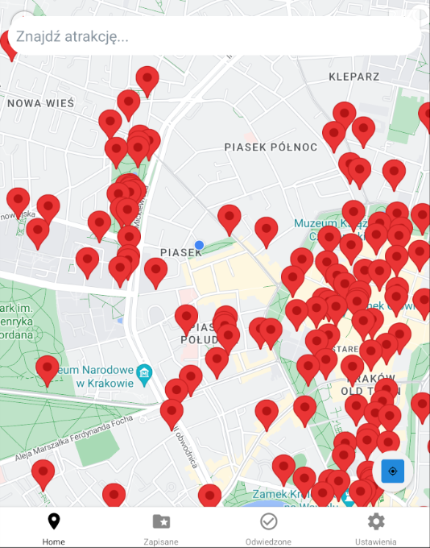
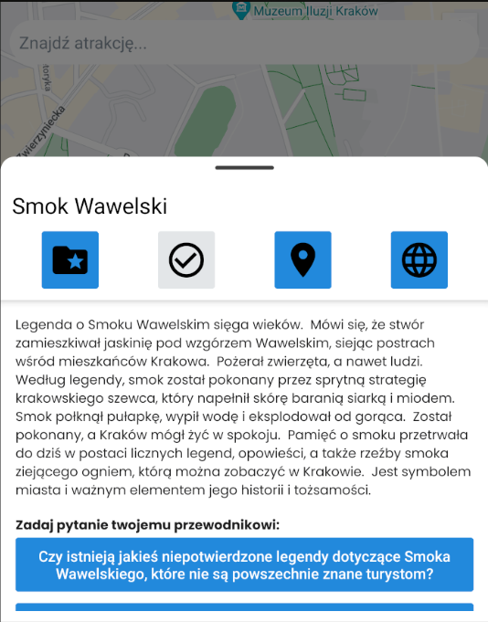
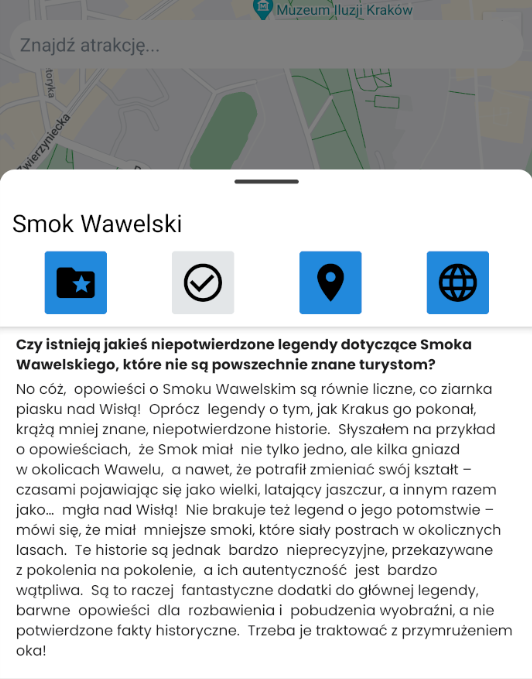
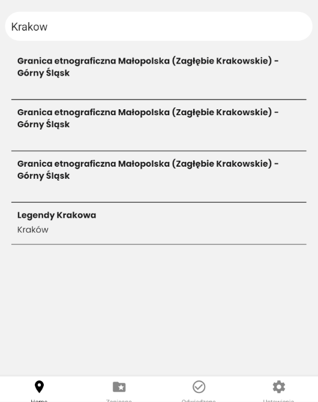
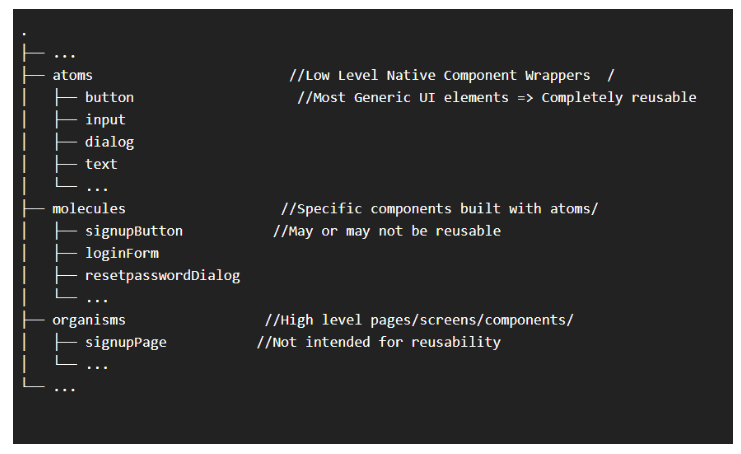

# Tourist guide
AI Travel Guide is a mobile application that acts as a smart personal tour guide. Users can explore an interactive map with various tourist attractions. When a user taps on a location, the app sends a request to an AI model, which generates a detailed description or story about the selected place — instantly and contextually.

## Preview
### 🗺️ Attractions on the Map  
Users can browse an interactive map with marked tourist attractions. Each point is clickable and leads to a detailed view powered by AI-generated content.

---

### 📖 Attraction Details View – Part 1  
After selecting a location, the app fetches and displays a detailed description of the place, generated dynamically by AI.

---

### 📖 Attraction Details View – Part 2  
Extended information and additional context are shown, including fun facts or historical background.

---

### 🔍 Search Results  
Users can search for specific attractions or keywords, with results displayed in a clear, scrollable list.

## Functional requirements

### Main View (Map)
Upon launching the application, the user sees the main screen. The majority of this screen is occupied by a map displaying the user's current location and pins marking nearby tourist attractions. Attractions that the user has already visited are distinguished by a different color. In the upper corner, there is a magnifying glass icon that leads to the attractions list view. Clicking on a tourist attraction opens the attraction details view.

### Tourist Attraction Details View
This view shows a description of the tourist attraction and buttons for:

- **Add to my attractions:** allows the user to save the attraction.
- **Add to visited attractions:** saves the attraction on the list of visited attractions.
- **Navigate:** starts the route to the destination.
- **Search on the internet:** opens a browser with the attraction's name.

 Visited attractions are appropriately marked in this view.

### Attractions List View
The attractions list view occupies the entire screen of the application and contains a list of all tourist attractions available in the application. At the top of the screen, there is a search bar that allows users to search for attractions by city name.

### Saved Attractions View
This view contains the attractions saved by the user. Clicking on any of them takes the user to the tourist attraction details view. Users can add a note to each attraction on the list.

### Visited Attractions View
This view contains the attractions visited by the user. Clicking on any of them takes the user to the tourist attraction details view. Users can add a note to each attraction on the list.

### Settings
An option to enable dark mode.

### Navigation
A bottom navigation bar with links to other views of the application:

- Map
- Saved
- Visited
- Settings

## Project structure

Feature-Based Project Structure

https://www.waldo.com/blog/react-native-project-structure

### Atoms
First, you'll break your UI into the smallest low-level native wrappers. These are custom UI wrappers around native components. For instance, you could have a generic button component. It will be a higher-order component and will conditionally render the TouchableOpacity, TouchableHighlight, or Button component using props.

After this point, you'll never want to directly use the above native components to build UIs. You'll use your custom button component.

### Molecules
Next, you'll use your atoms to create molecules! In other words, you'll use your custom button component to create different buttons. Maybe you'll have a different button for your login form and another button for redirecting to the signup form.

These components may or may not be completely reusable. But they should be rendered reusable on at least more than one page of your application.

### Organisms
Finally, you'll use your molecules or molecules and atoms to build organisms! You'll use the above components to build screens and pages.

For instance, you can use your login form and login buttons to create the entire login page. Your organisms are not intended for reusability, but if you can reuse them, kudos to you!
